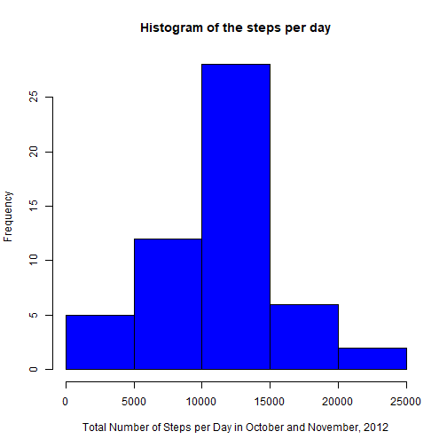
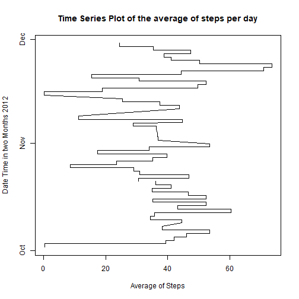
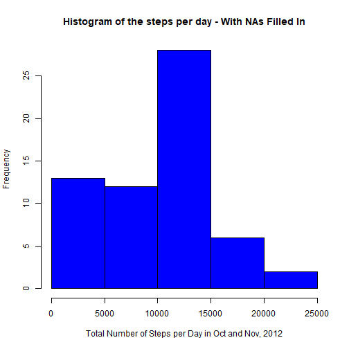
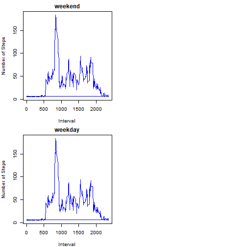

```r
# Project 1 - Reproducible Search Course - Johns Hopkins University
# Rejane Rodrigues de Carvalho Pereira (18/11/2020, Brasilia-DF, Brazil)

library(data.table)
library(dplyr)
library(datasets)
library(graphics)
library(knitr)


# Reading the file 
unzip(zipfile = "./Data/activity.zip", exdir = "Data")
dataset <- read.csv("./Data/activity.csv",
                    sep = ",",  stringsAsFactors=FALSE, na.strings = "NA")
 
dataset.clean <- na.omit(dataset)

#==================================================================
# Without missing values
# Creating the histogram of the total number of steps taken per day
# Reporting mean and median of the total of steps taken per day
#==================================================================

# Creating the dataset with the total number of the daily steps
steps.total <- 
    dataset.clean %>%
    group_by(date) %>%
    summarise(steps.sum = sum(steps))  %>%
    ungroup
```

```
## `summarise()` ungrouping output (override with `.groups` argument)
```

```r
total.sum <- sum(steps.total$steps.sum)
total.mean <- mean(steps.total$steps.sum)
total.median <- median(steps.total$steps.sum)
print(paste("Sum of the total number of the steps: ", total.sum))
```

```
## [1] "Sum of the total number of the steps:  570608"
```

```r
print(paste("Mean of the total number of the steps: ", total.mean))
```

```
## [1] "Mean of the total number of the steps:  10766.1886792453"
```

```r
print(paste("Median of the total number of the steps: ", total.median))
```

```
## [1] "Median of the total number of the steps:  10765"
```

```r
# Creating the histogram about daily steps database with NAs filtered
with(steps.total, 
     hist(steps.sum, 
          main="Histogram of the steps per day",
          xlab="Total Number of Steps per Day in October and November, 2012",
          ylab="Frequency", col="blue"))
```



```r
#=================================================================
# Creating the Time Series Plot: Total number of steps per day
# Reporting the average daily activity pattern
#=================================================================

#Creating the dataset with the mean of the daily steps
steps.mean <- 
    dataset.clean %>%
    group_by(date) %>%
    summarise(steps.mean = mean(steps))  %>%
    ungroup 
```

```
## `summarise()` ungrouping output (override with `.groups` argument)
```

```r
#Creating the dataset with hour and minute
steps.date.interval <- 
    dataset.clean %>%
    mutate(hour    = interval%/%100,
           minute  = interval%%100) 

# Creating the dataset with the mean of the daily steps and date time
steps.mean.date <- 
    steps.date.interval %>%
    inner_join(steps.mean,
               by = c("date"), na_matches = "never") %>%
    
    mutate(date.time = strptime(paste(date, hour, minute, sep="-"),
                                format="%Y-%m-%d-%H-%M")) 

 
# Creating the Time Series Plot
with(steps.mean.date, 
     plot(steps.mean, 
          date.time,
          main="Time Series Plot of the average of steps per day",
          xlab="Average of Steps",
          ylab="Date Time in two Months 2012", 
          type= "l"))
```



```r
#==================================================================
# With missing values
# Creating the histogram of the total number of steps taken per day
# Reporting mean and median of the total of the steps taken per day
#==================================================================

# Counting the number of the row with NAs
steps.na <- 
    dataset %>% 
    filter(is.na(steps)) %>%
    summarise(count.na = n())  

#Creating the mean dataset of the daily steps with NAs
steps.mean.na <- 
    dataset %>%
    select(date, interval, steps) %>%
    group_by(date) %>%
    summarise(steps.mean = mean(steps, na.rm=TRUE))  %>%
    ungroup
```

```
## `summarise()` ungrouping output (override with `.groups` argument)
```

```r
total.mean.filled <- round(mean(steps.mean.na$steps.mean, na.rm=TRUE),0)

# Creating the mean dataset of the daily steps with NAs filled
steps.mean.filled <- 
    steps.mean.na %>%
    group_by(date) %>%
    mutate (steps.mean.filled = as.numeric(gsub("NaN", total.mean.filled,
                                    steps.mean))) %>%
    ungroup  %>%
    select(date, steps.mean.filled)

# Creating the total number dataset of the daily steps with NAs
steps.total.na <- 
    dataset %>%
    group_by(date) %>%
    summarise(steps.sum = sum(steps, na.rm=TRUE))  %>%
    ungroup 
```

```
## `summarise()` ungrouping output (override with `.groups` argument)
```

```r
# Filtering the total number dataset of the daily steps with NAs
# And Filling with mean daily steps
steps.total.na.filled <- 
    steps.total.na %>%
    group_by(date) %>%
    filter(steps.sum==0) %>%
    mutate (steps.filled = as.integer(gsub("0", total.mean.filled, steps.sum))) %>%
    ungroup  %>%
    select(date, steps.filled)

# Creating the total number dataset of the daily steps  without NAs
steps.total.not.na <- 
    steps.total.na %>%
    group_by(date) %>%
    filter(steps.sum != 0) %>%
    rename(steps.filled = steps.sum)
    
# Creating the daily steps database with NAs filled by joining 2 previous dataset 
steps.total.filled <- 
    steps.total.not.na %>%
        rbind(steps.total.na.filled)

total.sum.filled <- sum(steps.total.filled$steps.filled)
total.median.filled <- median(steps.total.filled$steps.filled)
print("NAs filled in:")
```

```
## [1] "NAs filled in:"
```

```r
print(paste("Sum of the total number of the steps: ", total.sum.filled))
```

```
## [1] "Sum of the total number of the steps:  570904"
```

```r
print(paste("Mean of the total number of the steps: ", total.mean.filled))
```

```
## [1] "Mean of the total number of the steps:  37"
```

```r
print(paste("Median of the total number of the steps: ", total.median.filled))
```

```
## [1] "Median of the total number of the steps:  10395"
```

```r
# Creating the histogram about daily steps database with NAs filled 
with(steps.total.filled, 
     hist(steps.filled, 
          main="Histogram of the steps per day - With NAs Filled In",
          xlab="Total Number of Steps per Day in Oct and Nov, 2012",
          ylab="Frequency", col="blue"))
```



```r
# PREPARING THE ORIGINAL DATASET WITH THE NAs FILLED IN FOR THE NEXT ASSIGNMENT

# Filtering the original dataset of the daily steps with NAs
# And Filling with mean daily steps
dataset.original.na.filled <- 
    dataset %>%
    left_join(steps.total.filled,
              by = c("date"), na_matches = "never") %>%
    filter(is.na(steps)) %>%
    mutate(steps.filled =   total.mean.filled) %>%
    select(date, interval, steps.filled)

# Creating the original dataset of the steps without NAs
dataset.original.not.na <- 
    dataset %>%
    filter(!is.na(steps)) %>%
    select(date, interval, steps) %>%
    rename(steps.filled = steps)

# Creating the original steps database with NAs filled in by joining 2 previous dataset 
dataset.original.filled <- 
    dataset.original.not.na %>%
    rbind(dataset.original.na.filled)


#==================================================================
# Are there differences in activity patterns between weekdays and 
# weekends?
# Creating the panel plot containing a Time Series Plot: 
# 5-minute interval (x-axis) and the average number of steps taken,
# averaged across all weekday days or weekend days (y-axis).
#=================================================================

#Creating the dataset with the mean of the daily steps
steps.mean.interval <- 
    dataset.original.filled %>%
    group_by(interval) %>%
    summarise(steps.mean = mean(steps.filled))  %>%
    ungroup 
```

```
## `summarise()` ungrouping output (override with `.groups` argument)
```

```r
#Creating the dataset with hour and minute
steps.date.interval <- 
    dataset.original.filled %>%
    mutate(hour    = interval%/%100,
           minute  = interval%%100) 

# Creating the dataset with the mean of the daily steps and date time
steps.mean.date.interval <- 
    steps.date.interval %>%
    inner_join(steps.mean.interval,
               by = c("interval"), na_matches = "never") %>%
    mutate(date.time = strptime(paste(date, hour, minute, sep="-"),
                                format="%Y-%m-%d-%H-%M"))  

# Creating the dataset with new variable that identifies the weekends days
steps.mean.weekend <- 
    steps.mean.date.interval %>%
    filter((weekdays(date.time) %in%  c("Saturday", "Sunday"))) %>%
    mutate(type.day = "weekend")

# Creating the dataset with new variable that identifies the weekdays
steps.mean.weekday <- 
    steps.mean.date.interval %>%
    filter(!weekdays(date.time) %in% c("Saturday", "Sunday")) %>%
    mutate(type.day = "weekday")

# Creating the dataset with new variable that identifies the weekend and
# weekdays by joining 2 previous dataset 
steps.mean.week <- 
    steps.mean.weekday %>%
    rbind(steps.mean.weekend) 

# Defining the factor variable
steps.mean.week$type.day <- factor(steps.mean.week$type.day, levels = c("weekday","weekend"))   


par(mfcol= c(2, 2), mar = c(4, 4, 2, 2))

# Creating the Time Series Plot for Weekend
with(subset(steps.mean.week, type.day=="weekend"), 
     plot(interval,
     steps.mean,
     main="weekend",
     xlab="Interval",
     ylab="Number of Steps",
     type="l",
     col= "blue"))

# Creating the Time Series Plot for Weekday
with(subset(steps.mean.week, type.day=="weekday"), 
     plot(interval,
     steps.mean,
     main="weekday",
     xlab="Interval",
     ylab="Number of Steps",
     type= "l",
     col= "blue"))
          


setwd("C:/Users/Rejane/Documents/Licenca_Capacitacao/R/Scientist_R_Project")

knit2html("PA1.Rmd",
          spin(hair="./PA1.R", 
               knit = FALSE), force_v1 = TRUE)
```

```
## 
## 
## processing file: PA1.Rmd
```

```
## 
  |                                                                                 
  |                                                                           |   0%
  |                                                                                 
  |.........................                                                  |  33%
##   ordinary text without R code
## 
## 
  |                                                                                 
  |..................................................                         |  67%
## label: unnamed-chunk-2
```

```
## 
  |                                                                                 
  |...........................................................................| 100%
##   ordinary text without R code
```

```
## output file: PA1.md
```

```r
if (interactive()) browseURL("./PA1.html")
```



